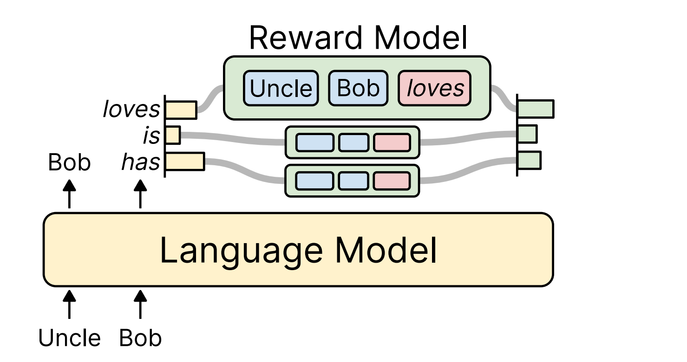

# Reward Augmented Decoding (RAD) for Qwen 2.5 3B Uncensored Model to Reduce Toxicity

diagram: 


This repository contains code for making Qwen 2.5 3B uncensored model generate non-harmful contents using RAD (Reward Augmented Decoding) technique. Just like in the Paper, here candidate tokens are taken to generate multiple continuations, then analyze and choose the one with the least toxicity.

Citation: If you find this repository useful, please consider citing the following paper:

```bibtex
@article{zhang2023rad,
  title={RAD: Large Language Model Generation with Reward Augmented Decoding},
  author={Haikang Deng and Colin Raffel},
  journal={arXiv preprint arXiv:https://arxiv.org/abs/2310.09520},
  year={2023}
}
```
Here is the [link](https://arxiv.org/abs/2310.09520) to the original paper.